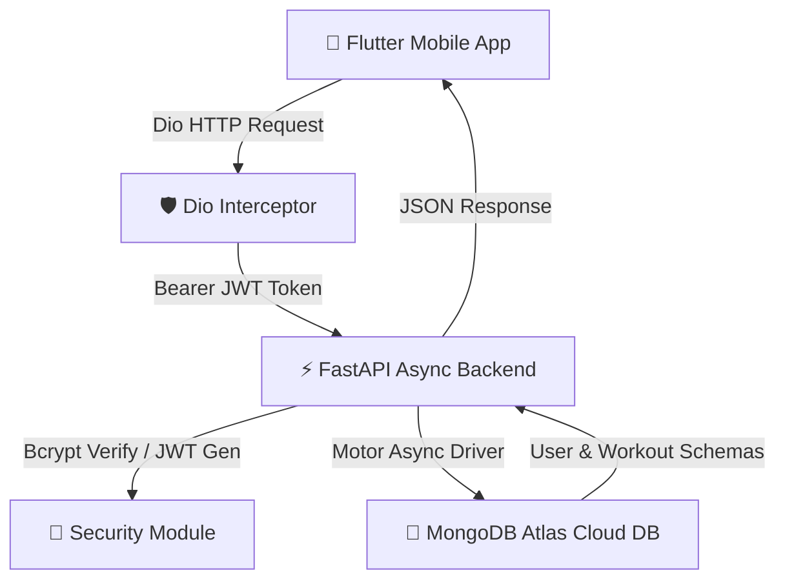

<div align="center">

  # 🥊 AKBURAK SPOR KULÜBÜ
  ### Premium Fitness, Boks & Wushu Sanda Mobil Eğitim Platformu

  [](https://flutter.dev)
  [](https://fastapi.tiangolo.com)
  [](https://www.mongodb.com/cloud/atlas)
  [](https://jwt.io)
  [](#-güvenlik--kimlik-doğrulama-v25)

  *Dövüş sanatları mirasını modern mobil teknoloji, duyusal geri bildirim, oyunlaştırılmış liderlik tablosu ve bulut mimarisi ile birleştiren yeni nesil sporcu uygulaması.*

  ---

  

</div>

---

## 🌟 Öne Çıkan Özellikler

### 🥊 1. Dövüş Sanatları & Fitness Antrenman Motoru
- **Kategoriye Özel Rutinler:** Boks, Wushu Sanda, Kardiyo, Evde ve Kulüpte antrenman modülleri.
- **İnteraktif Zamanlayıcı & Görsel Adrenalin Nabzı:** Son 3 saniyede kırmızıya dönen pulsing sayaç efektleri.
- **Duyusal Geri Bildirim (Sensory Feedback):** Titreşim (`HapticFeedback`) ve ses efektleri (`gong.mp3`) ile geçiş bildirimleri.
- **Sonraki Egzersiz Önizlemesi:** Dinlenme aralarında arkası bulanıklaştırılmış gelecek hareket kartı.

### 🛡️ 2. Güvenlik & Yetkilendirme (V2.5)
- **Bcrypt Şifre Kriptolaması:** Parolalar MongoDB veritabanına yazılmadan önce `bcrypt` algoritması ile tuzlanarak hashlenir.
- **JWT (JSON Web Token) İletişimi:** Oturum açıldığında imzalı erişim jetonu üretilir.
- **Flutter Secure Storage:** JWT jetonları cihaz düzeyinde KeyStore / KeyChain üzerinde güvenle saklanır.
- **Dio Authorization Interceptor:** Tüm HTTP isteklerine otomatik `Authorization: Bearer <token>` başlığı eklenir.

### 💬 3. Hoca - Sporcu İletişim Hattı & Dashboard
- **Antrenör Paneli (Trainer Dashboard):** Eğitmenlerin özel idman programı hazırlaması ve atlet takibi.
- **Birebir Canlı Sohbet:** Sporcuların antrenörlerle direkt mesajlaşabileceği mesajlaşma odaları.
- **Video Sıkıştırma Service:** Antrenör videolarının kalitesi korunarak 2-3MB paketlere sıkıştırılıp yüklenmesi.

### 🏆 4. Oyunlaştırma & Liderlik Tablosu (Leaderboard)
- **Rozet Seviyeleri (Prestige System):** Bronze, Silver ve Gold eğitmen/sporcu prestij rozetleri.
- **Neon Podyum UI:** Top-3 sporcular için neon ışıklı özel derece podyumu.
- **Seri Takibi (Streak Counter):** 5+ gün kesintisiz idman yapan sporcular için `🔥` ateş simgesi göstergesi.

---

## 📐 Sistem Mimarisi



---

## 🛠️ Teknolojiler & Kütüphaneler

### 📱 Frontend (Flutter)
| Kütüphane | Kullanım Amacı |
| :--- | :--- |
| **Flutter Riverpod** | Reaktif durum yönetimi (State Management) |
| **GoRouter** | Yapılandırılmış sayfa yönlendirmesi ve rotalama |
| **Dio** | HTTP istemcisi ve Authorization interceptor desteği |
| **Flutter Secure Storage** | JWT jetonlarının güvenli cihaz hafızasında saklanması |
| **AudioPlayers & Haptics** | Sesli uyarılar (gong) ve dokunsal titreşimler |
| **FL Chart** | Sporcu performans analizi ve grafik gösterimleri |

### ⚡ Backend (Python FastAPI)
| Kütüphane | Kullanım Amacı |
| :--- | :--- |
| **FastAPI** | Yüksek performanslı asenkron REST API framework'ü |
| **Motor** | MongoDB için asenkron Python sürücüsü |
| **Pydantic / Pydantic-Settings**| Veri doğrulama ve `.env` ortam değişkeni yönetimi |
| **Bcrypt** | Endüstri standardı parola hashleme |
| **Python-Jose** | İmzalı JWT erişim jetonu üretimi ve doğrulaması |

---

## 🚀 Kurulum ve Çalıştırma

### 1. Backend Kurulumu (FastAPI)

```bash
# Backend klasörüne geçin
cd backend

# Sanal ortam oluşturun ve aktifleştirin
python3 -m venv .venv
source .venv/bin/activate

# Bağımlılıkları yükleyin
pip install -r requirements.txt

# Sunucuyu başlatın
uvicorn main:app --reload --host 0.0.0.0 --port 8000
```

*Sunucu varsayılan olarak `http://localhost:8000` adresinde çalışacaktır. Swagger dökümantasyonuna `http://localhost:8000/docs` adresinden erişebilirsiniz.*

---

### 2. Frontend Kurulumu (Flutter)

```bash
# Proje kök dizininde bağımlılıkları indirin
flutter pub get

# Android Emülatör veya cihazınızda başlatın
flutter run
```

---

## ☁️ Bulut Canlı Yayınlama (Production Deployment)

Uygulama arka planı **Render** veya **Railway** üzerinde canlıya alınmaya hazır hale getirilmiştir:
- **[Procfile](file:///Users/hamzakursatakburak/Documents/AKB_APP/Procfile)**: `web: uvicorn backend.main:app --host 0.0.0.0 --port $PORT`
- **MongoDB Atlas**: Ücretsiz M0 Cluster bağlantı dizisi `MONGO_URI` üzerinden dinamik olarak beslenir.

---

## 📜 Sürüm Geçmişi

| Sürüm | Ana Odak | Durum |
| :---: | :--- | :---: |
| **V1.0** | Proje İskeleti, Rotalama, Alt Navigasyon | ✅ Tamamlandı |
| **V1.5** | Açılış (Splash) & Boks Eldiveni Çarpışma Animasyonları | ✅ Tamamlandı |
| **V1.7** | Python FastAPI Asenkron MongoDB REST API | ✅ Tamamlandı |
| **V1.8** | Antrenör Paneli & Video Sıkıştırma | ✅ Tamamlandı |
| **V1.9** | Onboarding Flow & Vücut BMI Avatarları | ✅ Tamamlandı |
| **V2.0** | Tam Backend API Entegrasyonu & Dio İstemcisi | ✅ Tamamlandı |
| **V2.2** | Liderlik Tablosu & Neon Podyum Sistemleri | ✅ Tamamlandı |
| **V2.3** | Hoca-Sporcu Canlı İletişim Hattı | ✅ Tamamlandı |
| **V2.4** | Bulut Mimari & MongoDB Atlas Hazırlığı | ✅ Tamamlandı |
| **V2.5** | **Bcrypt & JWT Güvenlik Sertleştirmesi** | ✅ Tamamlandı |

---

<div align="center">

  Developed with ❤️ by **Hamza Kürşat Akburak**
  
  **Akburak Spor Kulübü © 2026**

</div>
